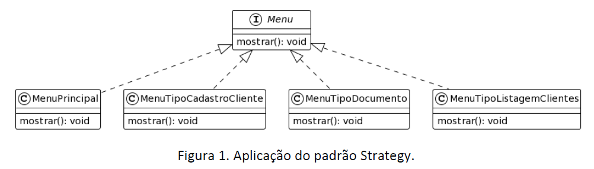
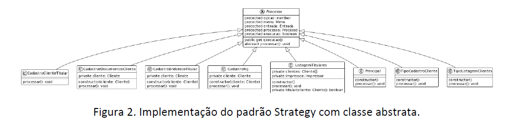

## Atividade II

Empresa criada: Ocean Solutions

Fundador, Dev e Engenheiro de Software: André Salerno

- Sistema: Atlantis
- Fase: sistema incompleto (CLI) - sem SGBD
- Perfil: generalista
- Padrões usados: Singleton e Strategy
- Objetivo: implementar as funcionalidades obrigatórios e ainda não implementadas
    - CRUD de cliente, incluindo clientes dependentes
    - Listagem de clientes dependentes para um titular específico
    - Listagem do titular para o cliente dependente específico 


## Diagrama de classe - Padrão Strategy (usado)



## Diagrama de classe Esperado




## Rodar projeto

```powershell
git clone https://github.com/andresalerno/TPIII-atvii-atlantis.git
```

```powershell
# rodar esse comando onde está o arquivo package.json
npm install
```

```powershell
# atvii folder
npm run dev
```